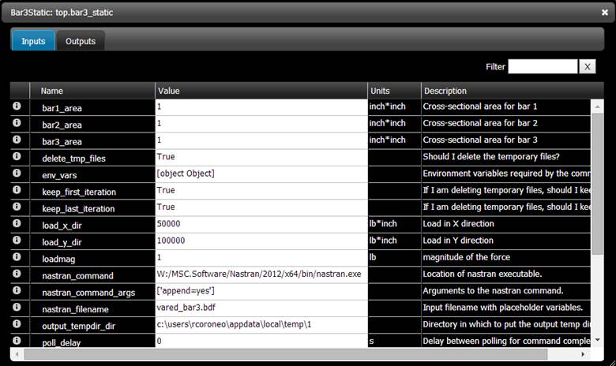
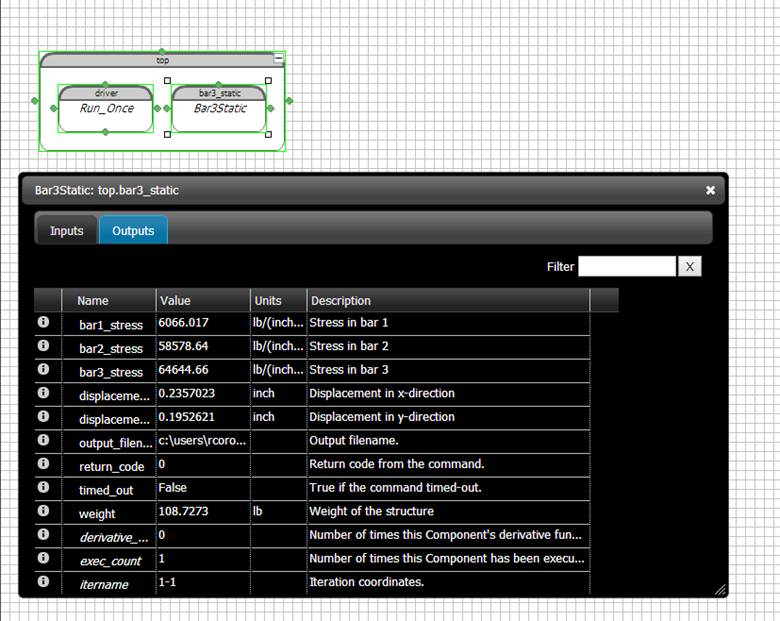
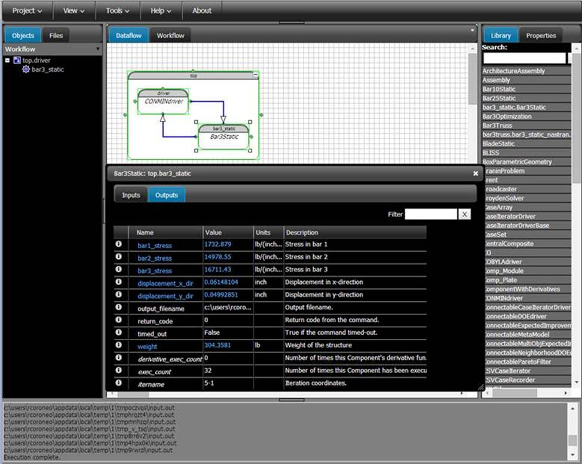

=================================================
Using the Nastran Component with the OpenMDAO GUI
=================================================

.. _nastranwrapper_gui_label:  

Overview
~~~~~~~~

Here is a tutorial for using the Nastran plugin while using the OpenMDAO GUI.

Initial Setup
~~~~~~~~~~~~~

Install the Nastran wrapper

::

  plugin install --github nastranwrapper

Open the OpenMDAO GUI

::

  openmdao gui

Create a new project by clicking the New Project button and then filling out the form that pops up.

Analysis
~~~~~~~~

From the Library tab on the right, drag and drop an Assembly onto the Dataflow workspace in the center of the GUI. You will be prompted for a name. Name it ``top``.

We need to add two files to the project: the definition of the Nastran component that tells OpenMDAO where input and output values are in the BDF file and also the BDF file itself.

Click on the Files tab in the left section of the GUI. Select New File from the File menu under that tab. You will be asked for the file name. It could be anything with a Python extension of .py but for this tutorial name it ``bar3_static.py``. Now we need to add code to that file. Double click it in the Files tab. A code editor window comes up. Add the following code to it.

::

  import operator

  import math
  from numpy import zeros

  # pylint: disable-msg=E0611,F0401
  from openmdao.main.api import Component
  from openmdao.lib.datatypes.api import Float

  from nastranwrapper.nastran import NastranComponent

  class Bar3Static(NastranComponent):
     """ Model of a three bar truss - Nastran Implementation."""

     # set up interface to the framework
     # pylint: disable-msg=E1101

     bar1_area  = Float(1., nastran_card="PROD",
                        nastran_id="11", nastran_fieldnum=3,
                        low=0.0009, high=10000.,
                        iotype='in', units='inch*inch',
                        desc='Cross-sectional area for bar 1')

     bar2_area  = Float(1., nastran_card="PROD",
                        nastran_id="12", nastran_fieldnum=3,
                        low=0.0009, high=10000.,
                        iotype='in', units='inch*inch',
                        desc='Cross-sectional area for bar 2')

     bar3_area  = Float(1., nastran_card='PROD',
                        nastran_id="13", nastran_fieldnum=3,
                        low=0.0009, high=10000.,
                         iotype='in', units='inch*inch',
                         desc='Cross-sectional area for bar 3')

     load_x_dir = Float(50000.0, nastran_card="FORCE",
                        nastran_id="8", nastran_fieldnum=5,
                        iotype='in', units='lb*inch',
                               desc='Load in X direction')

     load_y_dir = Float(100000.0, nastran_card="FORCE",
                        nastran_id="8", nastran_fieldnum=6,
                        iotype='in', units='lb*inch',
                         desc='Load in Y direction')

     loadmag = Float(1.0, nastran_card="FORCE",
                     nastran_id="8", nastran_fieldnum=4,
                     iotype="in", units="lb",
                     desc="magnitude of the force")

     Youngs_Modulus = Float(30000000.0,
                            nastran_card="MAT1",
                            nastran_id="5",
                            nastran_fieldnum=2,
                            iotype='in',
                            units='lb/(inch*inch)',
                            desc='Youngs Modulus')

     weight_density = Float(0.284,
                            nastran_card="MAT1",
                            nastran_id="5",
                            nastran_fieldnum=5,
                            iotype='in', units='lb/(inch**3)',
                            desc='weight density of all bars')

     bar1_stress = Float(0., #nastran_func=stress1,
                         iotype='out',
                         units='lb/(inch*inch)',
                         desc='Stress in bar 1')
     bar2_stress = Float(0., #nastran_func=stress2,
                         iotype='out',
                         units='lb/(inch*inch)',
                         desc='Stress in bar 2')
     bar3_stress = Float(0., #nastran_func=stress3,
                         iotype='out',
                         units='lb/(inch*inch)',
                         desc='Stress in bar 3')

     displacement_x_dir = Float(0., iotype='out',
                                units='inch',
                                desc='Displacement in x-direction',
                                #nastran_func=xdisp)
                                nastran_header="displacement vector",
                                nastran_subcase=1,
                                nastran_constraints={"POINT ID." : "1"},
                                nastran_columns=["T1"])

     displacement_y_dir = Float(0., iotype='out',
                                units='inch',
                                desc='Displacement in y-direction',
                                #nastran_func=ydisp)
                                nastran_header="displacement vector",
                                nastran_subcase=1,
                                nastran_constraints={"POINT ID." : "1"},
                                nastran_columns=["T2"])

     #frequency = Float(0.1, iotype='out', units='Hz',
     #                    desc='Frequency in Hertz')

     def mass(filep):
         filep.reset_anchor()
         filep.mark_anchor("MASS AXIS SYSTEM (S)")
         return filep.transfer_var(1, 2)

     weight = Float(0., nastran_func=mass, iotype='out', units='lb',
                         desc='Weight of the structure')

     def execute(self):
         """ Simulates the analysis of a three bar truss structure.
             Force, Stress, Displacement,Frequency and Weight are returned at
             the Bar3Truss output.
         """

         # process all the input variables and convert them
         # to something nastran will enjoy

         # run, nastran, run
         super(Bar3Static, self).execute()

         # By now, all the variables with a nastran instruction
         # on how to parse them will be all set.
         # If you need to generate more output variables (like
         # the sum of two previously generated variables), now
         # is the time!

         stresses = []
         header = "S T R E S S E S   I N   R O D   E L E M E N T S      ( C R O D )"
         for i in range(1,4):
             constraints = {"ELEMENT ID." : str(i)}

             columns = ["AXIAL STRESS", "TORSIONAL STRESS"]
             [[axial, torsion]] = self.parser.get(header, None, \
                                              constraints, columns)
             axial, torsion = map(float, [axial, torsion])
             stresses.append((axial, torsion))

         [self.bar1_stress, self.bar2_stress, self.bar3_stress] = \
                           map(calculate_stress, stresses)

  #end Bar3Truss

  def calculate_stress((ax, tors)):
     sigma = 2 * ax * ax
     tau = 3 * tors * tors
     val = math.sqrt(.5 * (sigma + tau))
     return val

Click Save to save that file.

Do a similar thing for adding the BDF file. Use the name ``vared_bar3.bdf``. Here are the contents of the BDF file.

::

  $ NASTRAN input file created by the MSC MSC.Nastran input file
  $ translator ( MSC.Patran 13.1.116 ) on November  30, 2009 at 13:30:13.
  $ Direct Text Input for Nastran System Cell Section
  $ Linear Static Analysis, Database
  SOL 101
  CEND
  ECHO = NONE
  SUBCASE 1
  $ Subcase name : Untitled.SC4
    SUBTITLE=Untitled.SC4
    SPC = 2
    LOAD = 13
    DISPLACEMENT(SORT1,REAL)=ALL
    SPCFORCES(SORT1,REAL)=ALL
    OLOAD(SORT1,REAL)=ALL
    FORCE(SORT1,REAL,BILIN)=ALL
    STRESS(SORT1,REAL,VONMISES,BILIN)=ALL
  BEGIN BULK
  PARAM    POST    0
  PARAM    K6ROT  40.
  $PARAM    WTMASS .00259
  PARAM    GRDPNT  0
  PARAM   PRTMAXIM YES
  $2345678123456781234567812345678123456781234567812345678
  $ Elements and Element Properties for region : prod.11
  PROD     11      5      !bar1_a
  $ Pset: "prod.11" will be imported as: "prod.11"
  CROD     1       11      1       2
  $ Elements and Element Properties for region : prod.12
  PROD     12      5      !bar2_a
  $ Pset: "prod.12" will be imported as: "prod.12"
  CROD     2       12      1       3
  $ Elements and Element Properties for region : prod.13
  PROD     13      5      !bar3_a
  $ Pset: "prod.13" will be imported as: "prod.13"
  CROD     3       13      1       4
  $ Referenced Material Records
  $ Material Record : mat1.5
  $ Description of Material :
  $23456781234567812345678123456781234567812345678123456781234567812345678123456
  MAT1     5      !youngs         .3      !rho                            +RC1
  +RC1    20000.  20000.  20000.
  $ Nodes of the Entire Model
  GRID     1               0.      0.      0.
  GRID     2              -100.   100.     0.
  GRID     3               0.     100.     0.
  GRID     4              100.    100.     0.
  $ Loads for Load Case : Untitled.SC4
  SPCADD   2       11
  LOAD     13     1.      1.       8
  $ Displacement Constraints of Load Set : spc.11.SC4
  SPC1     11      3456    1
  SPC1     11      123456  2
  SPC1     11      123456  3
  SPC1     11      123456  4
  $ Nodal Forces of Load Set : force.8
  $2345678123456781234567812345678123456781234567812345678
  FORCE    8       1       0      !loadmag !loadx !loady   0.
  $ Referenced Coordinate Frames
  ENDDATA 13664a4e

As a result of adding the ``bar3_static.py`` file to the project, a ``bar3_static.Bar3Static`` component was added to the Library on the right. From the Library tab on the right, drag and drop the ``bar3_static.Bar3Static`` component into the ``top`` Assembly box in the Dataflow tab of the main center screen. It will ask you to name the instance. Named it ``bar3_static``. You should now have two items in the ``top`` Assembly: the ``bar3_static`` element you just put there and the existing driver, ``Run_Once``.

Edit that new ``bar3_static`` instance by double clicking on it. In the instance edit window that comes up, click on the Inputs tab, if needed, to display a table of inputs and various attributes of the inputs. In the Value field for the ``nastran_command`` input, type the path to your Nastran executable. Use forward slashes regardless of operating systems when separating in the path. The path needs to be quoted. Due to a bug in OpenMDAO, you might have to try either single or double quotes. You can tell if it worked if the resulting string in that text cell has NO quotes.

In the Value field for the nastran_command_args, put ``[ 'append=yes' ]``. Do not put quotes of any kind around that entry.

In the Value field for the ``nastran_filename``, type the path to the BDF file, which in this example is ``vared_bar3.bdf``. Again use forward slashes and try single or double quotes.

While you are in this window, you can also change the inputs that you want to change, like any of the bar areas. Close the instance edit window.

Here is an example screenshot which shows the fields filled out for the inputs.

   Inputs for the Nastran Component

Now we need to add the ``bar3_static`` element to the workflow. Click on the Dataflow tab in the center section. Click on the Objects tab on the left section of the GUI. Drag and drop the ``bar3_static`` instance from the Dataflow onto the ``top.driver`` item in the Objects tab. As a result, you should see a small box with a plus sign in it next to ``top.driver`` in the Objects tab. Click on that box to expand the items below ``top.driver``. The ``bar3_static`` instance should now be under the ``top.driver`` instance.

Save the project by selecting Commit from the Project menu in the upper left. You will be asked for a commit comment. Enter something like "Static nastran tutorial - initial version".

We can now run the static model to just see if the Nastran component works. Go back to the Dataflow section. Right click on the ``top`` Assembly box and select Run from the menu. After a few seconds, all the elements should turn green indicating the outputs are valid. You can also look in the console area at the bottom of the GUI for any error messages. Double click on the ``bar3_static`` element. Click on the Outputs tab to see the outputs.

   Outputs for the Nastran Component After an Analysis Run

Optimization
~~~~~~~~~~~~

We need to add an optimizer to the Dataflow. Click on the Library tab. In the search box, type "optim" followed by Return to search for all the optimizers available. Drag and drop ``CONMINdriver`` ( you can experiment with others later ) over the existing driver element in the Dataflow. A window will pop up asking you if you want to replace the driver. Click Ok.

Now we need to setup the driver which in this case is an optimizer. Double click on the driver element in the Dataflow window. In the window that comes up, click on the Parameters tab. Click the Add Parameter button in the lower left of the window. In the New Parameter window that comes up, set Target to be ``bar3_static.bar1_area``. Set Low to be 0.001 and High to be 10000.0. Click Ok. Repeat this for ``bar2_area`` and ``bar3_area``. The data flow window should have been updated to show an implicit connection between driver and ``bar3_static`` by drawing a blue line between the two.

Next we need to set the objective for the optimizer. Click on the Objectives tab. Click on Add Objective. In the window that comes up, set Expression to be ``bar3_static.weight``. Click Ok.

For this tutorial, there are 5 constraints. To set these, click on the Contraints tab, then click the Add Constraint button in the lower left. In the window that comes up, enter the Expression:

::

  bar3_static.bar1_stress < 20000

Click Ok.

Repeat for ``bar2_stress`` and ``bar3_stress``.

Also add these two constraints

::

  bar3_static.displacement_x_dir < 0.20

  bar3_static.displacement_y_dir < 0.05

The ``CONMINdriver`` has some parameters of its own that need to be set. Click on the Inputs tab. Leave the defaults for most but for this tutorial, set these. Of course you can play with these values later.

::

  iprint = 0

  itmax = 30

  fdch = .00001

  fdchm = .00001

  ct = 0.00001

At this point, commit the project to save a version of it.

We are now ready to run the optimization. Right click on the ``top`` element in the Dataflow and select Run from the menu. The run should take a few minutes and will involve several runs of Nastran. Eventually, all the elements will be green again. Double click on the ``bar3_static`` element in the Dataflow. You can look at the resulting inputs and outputs. The Inputs tab shows the optimum design variables. The Outputs also include a value for the execution counts, ``exec_count``, for the Nastran Component.

   Outputs for the Nastran Component After an Optimization Run

